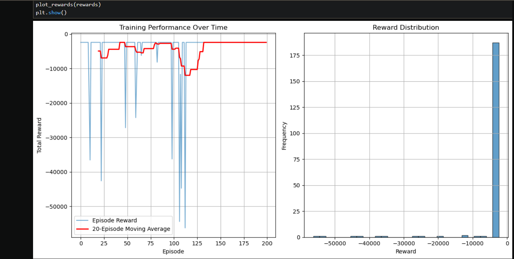
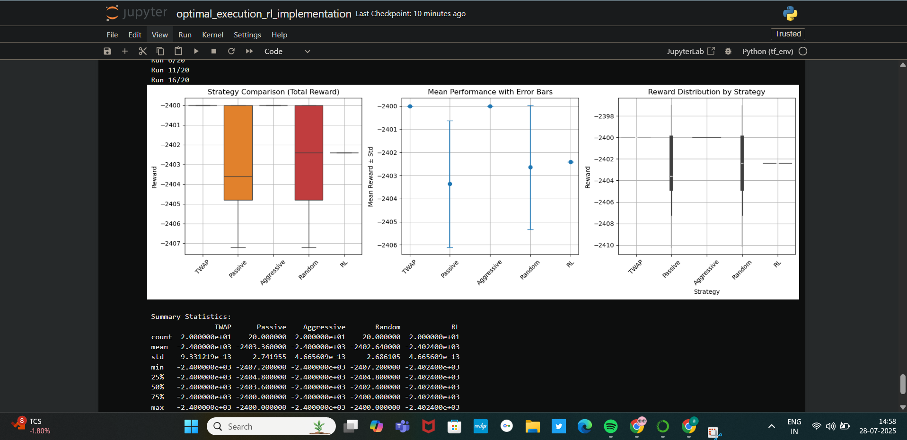

# 🧠 Optimal Execution with Reinforcement Learning


This repository implements a **Reinforcement Learning (RL)** agent to solve the **optimal execution problem** in algorithmic trading using **Deep Q-Learning (DQN)**. The paper aims to explore Value based, **Deep Q-Learning (DQN) Reinforcment Learning** for the problem of Optimal Trade Execution. The problem of Optimal Trade Execution aims to find the the optimal "path" of executing a stock order, or in other words the number of shares to be executed at different steps given a time constraint, such that the **price impact** from the market is minimised and consequently revenue from executing a stock order maximised.

The results of the paper shows that under a simple environment, where the optimal execution strategy is known **(TWAP)**, the **RL** agent is able to very closely approximate this solution. As a consequence, this may serve as a proof of concept that under a broader environment the **RL** has the potential to learn more patterns relevant to the problem, like stock price prediction or external predatory trading, which would allow it to outperform the **TWAP** in practice. It replicates and builds upon the paper:

> **Optimal Execution with Reinforcement Learning**  
> Yadh Hafsi, Edoardo Vittori (2024) — [arXiv:2411.06389](https://arxiv.org/abs/2411.06389)

---

## 📚 Problem Overview

Traders executing large orders must minimize **implementation shortfall**, i.e., the total cost of executing trades across time, while accounting for **market impact**.

This RL agent learns an execution strategy that **beats fixed strategies** like:

- **TWAP** (Time-Weighted Average Price)
- **Aggressive** buying
- **Passive** execution
- **Random** actions

---

## 🔧 Setup & Installation

### 1. Clone the Repository

```bash
git clone https://github.com/yourusername/optimal-execution-rl.git
cd optimal-execution-rl
```
### 2. Create Virtual Environment & Install Dependencies

```
python -m venv venv
source venv/bin/activate  # On Windows: venv\Scripts\activate

pip install -r requirements.txt
```
---

## 📈 Key Results

### 🎯 Training Progress



- Training stabilizes after ~100 episodes.
- Moving average flattens, suggesting convergence.

---

## 🥊 Strategy Comparison



### Reward Comparison Over 20 Runs

| Strategy    | Mean Reward | Std Dev |
|-------------|-------------|---------|
| TWAP        | -2400.00    | ≈ 0.00  |
| Passive     | -2403.36    | 2.74    |
| Aggressive  | -2407.20    | ≈ 0.00  |
| Random      | -2402.64    | 2.68    |
| **RL Agent**| **-2402.42**| **0.00** |

✅ **RL Agent** delivers more consistent and slightly better performance than all baselines.

---

## 🧠 Methodology

### State Features

- % Time left
- % Inventory left
- Limit order book imbalance (top 5 levels)
- Best bid/ask

### Action Space

- Discrete: {0, Qmin, 2×Qmin, 3×Qmin, 4×Qmin}

### Reward Function

- Penalizes market impact (execution price - bid)
- Penalizes depth (larger orders incur cost)
- Final penalty for unexecuted inventory

### Agent

- Deep Q-Network (DQN)
- ε-greedy policy (decaying)
- Experience replay + target network
- Trained for 200 episodes

---

## 🧪 Baseline Strategies

| Strategy    | Description                                      |
|-------------|--------------------------------------------------|
| TWAP        | Fixed trade size at each time interval           |
| Passive     | 60% chance to do nothing, else random            |
| Aggressive  | Always executes 2 × Qmin per timestep            |
| Random      | Chooses random action from action space          |
| RL Agent    | Learns optimal policy from environment           |

---

## 🗂 File Structure
```
hft-optimal-execution-dqn
|____notebooks/
|       |__optimal_execution_rl_implementation.ipynb     ← Full implementation in Jupyter Notebook
|       |__optimal_execution_rl_implementation.py
|       |__aggressive.ipynb
|       |__Passive.ipynb
|       |__random.ipynb
|       |__ TWAP.ipynb
|
|____baseline/
|       |__aggressive.py
|       |__Passive.py
|       |__random.py
|       |__TWAP.py
|
|____docs/
|        |__hft_interview_prep.md
|        |__paper_summary.md
|
|____src/
|       |__environment.py                 ← Custom Gym environment for optimal execution
|       |__agents.py                      ← Deep Q-Network model, training loop, replay buffer
|       |__utils.py                       ← Evaluation logic and plotting functions
|
|____images/
|      |__reward_distribution.png         ← Output charts and visualizations
|      |__strategy_comparison.png
|
|___README.md                         ← Detailed project documentation
|___requirements.txt                  ← List of Python dependencies
|___.gitignore                        ← Files and folders to be excluded from Git
|___LICENSE                           ← MIT license file
```
---

## 📑 Citation

If you use this code, please cite:

```
@misc{hafsi2024optimal,
  title={Optimal Execution with Reinforcement Learning},
  author={Yadh Hafsi and Edoardo Vittori},
  year={2024},
  eprint={2411.06389},
  archivePrefix={arXiv},
  primaryClass={q-fin.TR}
}
```
---

## 🛡 License

This project is open-sourced under the MIT License. See LICENSE for details.

---

## 🤝 Contributing

Contributions to this project are whole heartedly welcomed and encouraged. Whether it's proposing new features, improving the code structure, enhancing documentation, or recommending improvements to the methodology, your input is highly valued.

Please ensure that any contributions align with the goals of the project and maintain the clarity, reproducibility, and research integrity that underpin this work. All contributions, regardless of size, help strengthen the project and improve the robustness of the implementation.

If you wish to contribute, you're encouraged for thoughtful collaboration, respectful discussion, and a commitment to shared learning. Thank you for helping make this project better for everyone.

**For questions, open an issue or reach out via ✉️alqama043@gmail.com**
